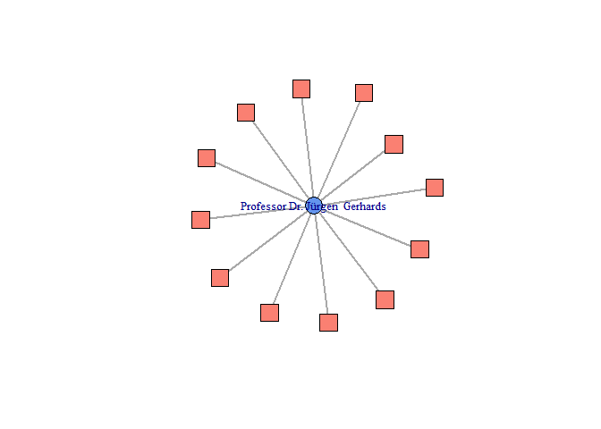
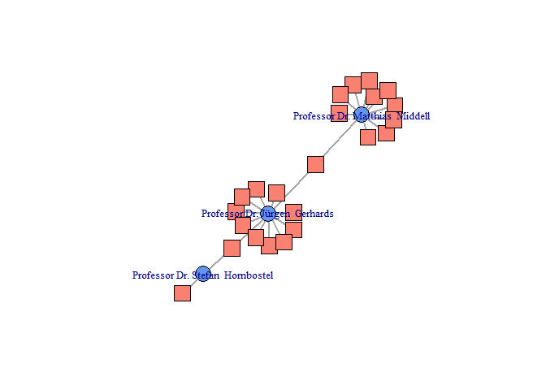
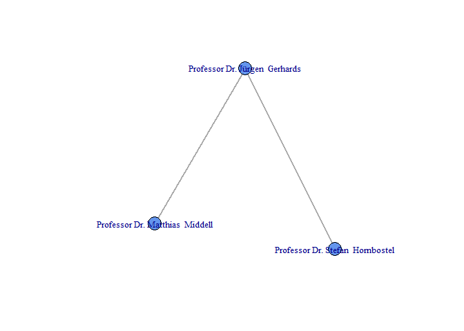
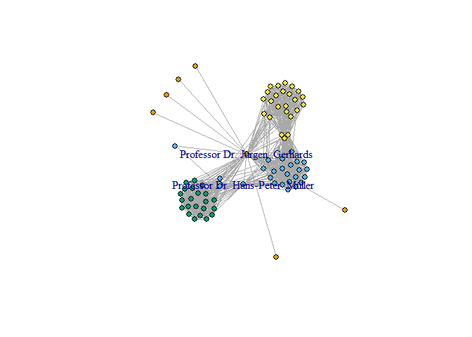

-   [TopicFunder](#topicfunder)
    -   [Disclaimer](#disclaimer)
    -   [Installation](#installation)
    -   [Usage](#usage)
    -   [Examples](#examples)
        -   [single-usage](#single-usage)
        -   [multiple requests](#multiple-requests)
        -   [exploring the DFG-network](#exploring-the-dfg-network)
        -   [extracting project information](#extracting-project-information)

TopicFunder
===========

TopicFunder is an R package that extracts funding information from the DFG-Database (GEPRIS) and produces dataframes for further analysis and visualization. It originated as a by-product of a masters thesis at the University of Oldenburg, Germany and is developed and maintained by Nico Blokker and Alena Klenke.

Please cite as: 

Blokker, Nico and Alena Klenke (2018). NicoB-UOL/TopicFunder: Updated Version. 
[](https://zenodo.org/badge/latestdoi/115342693)

Disclaimer
----------

The software in this package is for educational purposes only. It is provided WITHOUT ANY WARRANTY. USE AT YOUR OWN RISK! See LICENCE.txt for further information.

Installation
------------

`devtools::install_github('NicoB-UOL/TopicFunder')`

Usage
-----

This section is under development.

In generell there are two different ways to extract information. The first is single-usage based on one request at a time and the second chains multiple requests via the `apply`-family. In order to extract information about persons and subsequently projects three steps are necessary.
1. Find the ID of the researcher
+ this is done by entering the name of the person in question into
+ `findeR` or `fasteR`
2. use the ID to extract the corresponding projects
+ `find_info` or `wrap_it` 
3. visualize or analyze the data
+ this can be done by using `plotteR` or `steps` 
+ `steps` is experimental and will take a lot of time

Most of these functions heavily rely on the rvest, xml2 and httr packages, which are used for scraping the information. It is recommended to check whether or not it is alright to scrape the data (for starters checking the robots.txt, drop a note to the homepage operator/admin etc.). Furthermore one should put a appropriate delay between the requests (we recommend atleast 5 seconds, `reqtime = 5`)

Examples
--------

#### single-usage

-   `findeR('name', reqtime = 5)`
    -   which gives the Id, the name and the searchterm

``` r
library(TopicFundeR)
result <- findeR("Jürgen Gerhards", reqtime = 5)
result
```

    ##        id             name      searchterm
    ## 1 1464373 Gerhards, Jürgen Jürgen Gerhards

-   `find_info(ID, reqtime = 5)`
-   now we got the projecttitles, the project-ids, the number of projects and the affiliation additionally

``` r
df <- find_info(result$id, reqtime = 5)
str(df)
```

    ## 'data.frame':    12 obs. of  6 variables:
    ##  $ id             : num  1464373 1464373 1464373 1464373 1464373 ...
    ##  $ name           : chr  "Professor Dr. Jürgen  Gerhards" "Professor Dr. Jürgen  Gerhards" "Professor Dr. Jürgen  Gerhards" "Professor Dr. Jürgen  Gerhards" ...
    ##  $ projects       : chr  "Wie ausgeprägt ist die Solidarität zwischen den Bürgern und den Mitgliedsländern Europas?" "Die Wahl von Latein und Altgriechisch als schulische Fremdsprachen: Eine Distinktionsstrategie der oberen sozialen Klassen?" "Messung und Analyse von Prozessen des sozialen Wandels anhand der Vergabe von Vornamen: Aufbereitung und Auswertung des SOEP" "Die Europäische Union und die massenmediale Attribution von Verantwortung. Eine länder-, zeit- und medienvergle"| __truncated__ ...
    ##  $ project_id     : chr  "273553843" "321602695" "5404954" "5414296" ...
    ##  $ anzahl_projekte: int  12 12 12 12 12 12 12 12 12 12 ...
    ##  $ affiliation    : chr  "Adresse\n        \n                        \t\t\t\t\t\tFreie Universität Berlin Institut für Soziologie\n\t\t\t"| __truncated__ "Adresse\n        \n                        \t\t\t\t\t\tFreie Universität Berlin Institut für Soziologie\n\t\t\t"| __truncated__ "Adresse\n        \n                        \t\t\t\t\t\tFreie Universität Berlin Institut für Soziologie\n\t\t\t"| __truncated__ "Adresse\n        \n                        \t\t\t\t\t\tFreie Universität Berlin Institut für Soziologie\n\t\t\t"| __truncated__ ...

-   if we wanted we could already construct a network from this

``` r
plotteR(df, bipartite = TRUE)
```



-   the blue circle in the middle is the researcher and the red boxes are their projects
-   one could add other researchers in the same way and merge the dataframes or chain the requests

#### multiple requests

-   to generate a network with more than one researcher we add two other names and use some of the other functions (`fasteR` and `wrap_it`) to generate the dataframe

``` r
names <- c('Jürgen Gerhards', 'Matthias Middell', 'Stefan Hornbostel')
ids <- sapply(names, fasteR, reqtime = 5, id_only = TRUE)
df <- wrap_it(ids, reqtime = 5)
plotteR(df, bipartite = T)
```



-   this time we plot a one-mode instead of a two-mode projection of the network

``` r
plotteR(df, bipartite = F)
```



#### exploring the DFG-network

-   At this point one might wonder, how the scientist is embedded into the network as a whole
-   in order to answer this question, we use `steps` to get all the people working together on the projects
    -   but first we need the person's ID again:

``` r
result <- findeR("Jürgen Gerhards", reqtime = 5)
```

-   after that we can use the ID to extract the project IDs:

``` r
df <- wrap_it(result$id, reqtime = 5)
```

-   finally we use `steps` to find the cooperating scientists ('direct neighbours')

``` r
df2 <- lapply(df$project_id, steps, reqtime = .5)
step1 <- do.call(rbind, df2)
df_step1 <- dplyr::distinct(step1, id, project_id, .keep_all = T)
```

-   from this we can construct a one-mode network and write it out as an igraph-object

``` r
# construct network and write out igraph-object
graph <- plotteR(df_step1, plotting = F, bipartite = F)
```

-   here we need to load igraph explicitly for further analysis

``` r
# extract and colour communities
library(igraph) 
fg <- fastgreedy.community(graph)
V(graph)$colour <- membership(fg)

# get the scientists with highest and second highest degree
dg <- sort(degree(graph), decreasing = T)
dg[1:2]
```

    ##   Professor Dr. Jürgen  Gerhards Professor Dr. Hans-Peter  Müller 
    ##                               77                               49

-   the resulting network shows the interconnectedness of the collaborators

``` r
# plot the network
plot(graph, 
     vertex.label = ifelse(V(graph)$name == "Professor Dr. Jürgen  Gerhards"|
                               V(graph)$name == "Professor Dr. Hans-Peter  Müller",
                           V(graph)$name, NA),
     vertex.size = 6, vertex.color = V(graph)$colour)
```



-   by using `steps` again we could take a further look at the second degree neighbours and so on. However this would take a lot of time (exponential) and is not very stable.

#### extracting project information

-   let's say we are interested in the project texts for further analysis
-   by using `steps2` from v0.1.3, we could accomplish this task
    -   note that this function is also highly experimental, inefficient and time consuming
    -   the function takes the person's Id aswell as the project's ID, just make sure to use `projects = TRUE/FALSE`

``` r
result <- findeR("Jürgen Gerhards", reqtime = 5)
df <- steps2(result$id, reqtime = 5, projects = FALSE, texts = TRUE)
str(df$text)
```

    ##  chr [1:12] "Die Banken-, Euro- und Wirtschaftskrise der Europäischen Union hat die Solidarität zwischen den europäischen Lä"| __truncated__ ...
