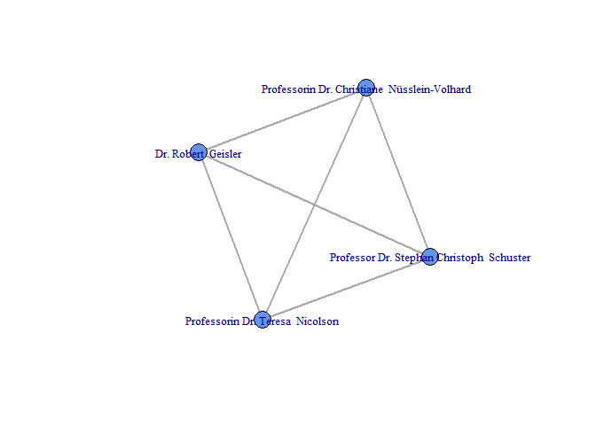

-   [TopicFunder](#topicfunder)
    -   [Disclaimer](#disclaimer)
    -   [Installation](#installation)
    -   [What does it do?](#what-does-it-do)
    -   [Usage](#usage)
        -   [TL;DR:](#tldr)
        -   [Longer version](#longer-version)

TopicFunder
===========

TopicFunder is an R package that extracts funding information from the DFG-Database (GEPRIS) and produces dataframes for further analysis and visualization. It originated as a by-product of a master's thesis at the University of Oldenburg, Germany and is developed and maintained by Nico Blokker and Alena Klenke.

Disclaimer
----------

The software in this package is for educational purposes only. It is provided WITHOUT ANY WARRANTY. USE AT YOUR OWN RISK! See LICENSE.txt for further information.

Installation
------------

`devtools::install_github('NicoB-UOL/TopicFunder')`

What does it do?
----------------

The package scrapes information from the GEPRIS-database of the DFG (Deutsche Forschungsgemeinschaft): <http://gepris.dfg.de>. Since there is no API (yet) it can be used to build and analyze dataframes.

Usage
-----

#### TL;DR:

Enter a name and get a dataframe back, which you can plot as a network

``` r
library(TopicFundeR)
name <- "Nüsslein-Volhard, Christiane"
df <- meta_fun(name, reqtime = 1)
```

    ## Joining, by = "project_id"

``` r
plotteR(df)
```



#### Longer version

-   `meta_fun` mainly wraps around three other functions:
-   `fasteR`: enter a name -&gt; get a ID
-   `find_info`: get information belonging to this ID (like affiliation or DFG-projects)
-   `steps`: finds the collaborating scientists of said projects based on the project-ID

-   instead of plotting the data directly you can also export it directly as a igraph-object
    -   plotteR(df, plotting = F)
-   if you are interested in more then one scientist you can also enter it into `meta_fun` or chain it with the `apply`-family

-   how to get names?
    -   `get_names` let's you specify field and subdisciplines even without entering a specific name first

``` r
get_names("Biologie", hits = 5)
```

    ## See 'http://www.dfg.de/dfg_profil/gremien/fachkollegien/faecher/index.jsp' for structure details
    ## for example set 'fachkollegium' to 201 and 'fach' to 20105

    ##                          names  ids
    ## 1              Fromherz, Peter 5470
    ## 2       Grieshaber, Manfred K. 5564
    ## 3     Meyer, Elisabeth Irmgard 5981
    ## 4 Nüsslein-Volhard, Christiane 6080
    ## 5              Rottland, Franz 6235
